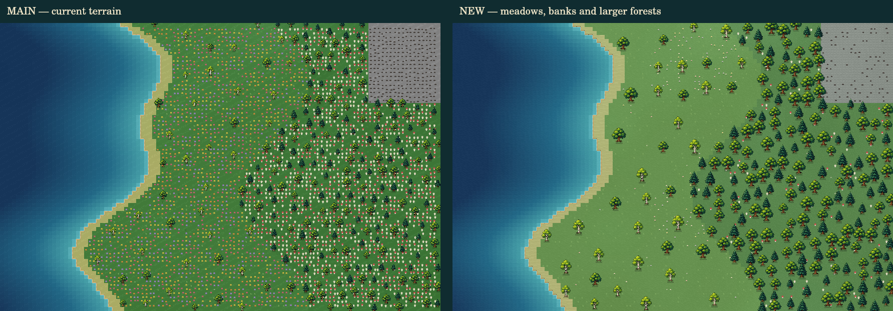

# 2D world and playability pass

The comparison uses the actual terrain painter, decoration code and existing plant atlas on the same controlled coastal grid. Left: main before this pass. Right: the new pass. It is a native canvas rendering, not an in-game screenshot; it does not verify the HUD, camera gestures or live simulation.

## Presentation

- Larger trees and canopies give forests more readable silhouettes alongside people and buildings.
- Softer meadow colors, quieter surface grain, grass strokes, sand ridges, rock strata and directional shoreline banks.
- Integer-safe decoration hashing removes the repeated flower/mushroom carpet. Sparse wildflower patches leave the ground readable.
- Ecological season names now select the correct autumn and winter plant variants.
- Partial terrain redraws clip translucent decorations to the erased region, preventing repeated darkening outside it.

## Navigation and interaction

- Drag the world to pan. Scroll to zoom around the cursor. Manual navigation stops following a person.
- Click the map to focus keyboard controls: WASD/arrows pan, +/− zoom, 0 fits the world, Space pauses/resumes.
- [ and ] cycle through people. Tab is available for normal keyboard focus navigation.
- The minimap shows the viewport and settlements. Click it to jump, or use the settlement selector. Fit and zoom buttons stay available on small screens.
- Selected-person card exposes health, energy, water, locate and follow controls.
- Armed tools show a footprint snapped to the rounded command tile, with the actual command radius. Escape cancels placement. Tool results remain visible over the map.
- Drag and pinch movement suppress accidental placement/selection. Off-map rounded placements are rejected. Person hit targets account for zoom and touch input.

## Verification limits

Automated checks cover camera bounds, cursor zoom invariance, integer hash distribution and season mapping. Frontend lint, formatting and tests must pass. Live browser/Electron pointer, touch, keyboard and responsive-layout QA remain to be done before merging. The local full build requires the generated WASM module, supplied by CI.

## Expanded gameplay tools

- Search the complete tool catalogue by name or category in a keyboard-accessible native dialog. Point tools arm placement; instant tools retain their existing behavior and command permissions.
- Inspect tiles for fertility, hazards, wild food and minerals. Building inspection shows integrity and construction state.
- Enter operational workshops, bakeries, mills, taverns and supported temples from the inspector, or visit nearby settlement squares and homes. Ruined/unfinished buildings never offer entry.
- Locate struggling people from their actual health, energy and hydration readings, then use the selected-person controls and world tools to respond.
- Settlement scenes count huts using the grid's origin; tavern/temple lookup accepts canonical building names and ownership fields.
